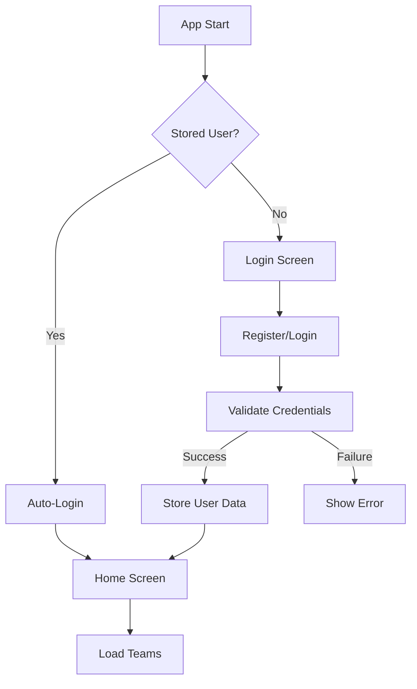

# Hockey Live App - Authentication & Data Storage Guide

## Overview

This document provides comprehensive documentation for the Hockey Live App's authentication system, data persistence, and user management features.

## Table of Contents

1. [Authentication Flow](#authentication-flow)
2. [User Registration](#user-registration)
3. [User Login](#user-login)
4. [Data Persistence](#data-persistence)
5. [Team Management](#team-management)
6. [Error Handling](#error-handling)
7. [Security Considerations](#security-considerations)
8. [Testing Procedures](#testing-procedures)
9. [Troubleshooting](#troubleshooting)

## Authentication Flow

### High-Level Flow



### Detailed Authentication Steps

1. **App Initialization**
   - Check for stored user data in AsyncStorage
   - Validate stored token and user information
   - Auto-login if valid data exists

2. **Registration Process**
   - Validate input fields (email, password, name)
   - Send registration request to backend
   - Hash password on server side
   - Store user in database
   - Return success message

3. **Login Process**
   - Validate input credentials
   - Hash provided password
   - Compare with stored password hash
   - Generate secure token
   - Return user data and token

4. **Data Persistence**
   - Store user object and token in AsyncStorage
   - Validate data before storing
   - Handle storage errors gracefully

## User Registration

### Frontend (Mobile App)

#### Endpoint
```
POST /api/v1/auth/register
```

#### Request Format
```json
{
  "email": "user@example.com",
  "password": "securepassword123",
  "full_name": "John Doe"
}
```

#### Validation Rules
- **Email**: Must be valid email format
- **Password**: Minimum 6 characters
- **Full Name**: Required, non-empty string

#### Success Response
```json
{
  "message": "User registered successfully",
  "user": {
    "id": "user_1",
    "email": "user@example.com",
    "full_name": "John Doe"
  }
}
```

#### Error Responses
- `400`: Email already registered
- `422`: Invalid input data
- `500`: Server error

### Backend Implementation

#### Password Security
- Passwords are hashed using SHA256
- Original passwords are never stored
- Hashes are compared during login

#### User Storage
```python
users_db[email] = {
    "id": "user_1",
    "email": "user@example.com",
    "full_name": "John Doe",
    "password": "hashed_password_string",
    "created_at": timestamp
}
```

## User Login

### Frontend (Mobile App)

#### Endpoint
```
POST /api/v1/auth/login
```

#### Request Format
```json
{
  "email": "user@example.com",
  "password": "securepassword123"
}
```

#### Success Response
```json
{
  "user": {
    "id": "user_1",
    "email": "user@example.com",
    "full_name": "John Doe"
  },
  "access_token": "secure_token_string",
  "token_type": "bearer"
}
```

#### Error Responses
- `401`: Invalid email or password
- `422`: Invalid input format
- `500`: Server error

### Authentication Flow Code

#### Mobile App Login Function
```javascript
const handleLogin = async (email, password) => {
  // 1. Validate input
  if (!email || !password) {
    Alert.alert('Error', 'Please enter both email and password');
    return;
  }

  // 2. Make API request
  const result = await makeApiRequest('/auth/login', {
    method: 'POST',
    body: JSON.stringify({ email, password })
  });

  // 3. Handle response
  if (result.success) {
    const userData = result.data.user;
    const token = result.data.access_token;
    
    // 4. Store data locally
    await storeUserData(userData, token);
    
    // 5. Update app state
    setUser(userData);
    setAuthToken(token);
    setIsLoggedIn(true);
  }
};
```

#### Backend Login Verification
```python
async def login(login_data: UserLogin):
    # 1. Check if user exists
    if login_data.email not in users_db:
        raise HTTPException(status_code=401, detail="Invalid email or password")
    
    # 2. Verify password
    user = users_db[login_data.email]
    hashed_password = hash_password(login_data.password)
    
    if user["password"] != hashed_password:
        raise HTTPException(status_code=401, detail="Invalid email or password")
    
    # 3. Generate token
    token = generate_token()
    tokens_db[token] = {"user_email": login_data.email, "created_at": time.time()}
    
    # 4. Return user data and token
    return LoginResponse(user=User(...), access_token=token)
```

## Data Persistence

### AsyncStorage Implementation

#### Storing User Data
```javascript
const storeUserData = async (userData, token) => {
  try {
    // Validate data before storing
    if (!userData || typeof userData !== 'object') {
      console.error('Invalid user data for storage:', userData);
      return false;
    }
    
    if (!token || typeof token !== 'string') {
      console.error('Invalid token for storage:', token);
      return false;
    }
    
    // Store data
    await AsyncStorage.setItem('user', JSON.stringify(userData));
    await AsyncStorage.setItem('authToken', token);
    
    return true;
  } catch (error) {
    console.error('Error storing user data:', error);
    return false;
  }
};
```

#### Loading Stored Data
```javascript
const loadStoredUser = async () => {
  try {
    const storedUser = await AsyncStorage.getItem('user');
    const storedToken = await AsyncStorage.getItem('authToken');
    
    if (storedUser && storedToken) {
      const userData = JSON.parse(storedUser);
      
      // Validate parsed data
      if (userData.email && userData.id && storedToken.length > 10) {
        setUser(userData);
        setAuthToken(storedToken);
        setIsLoggedIn(true);
        setCurrentScreen('home');
      } else {
        await clearStoredData();
      }
    }
  } catch (error) {
    console.error('Error loading stored user:', error);
  }
};
```

### Data Structure

#### Stored User Object
```json
{
  "id": "user_1",
  "email": "user@example.com", 
  "full_name": "John Doe"
}
```

#### Stored Auth Token
```
"eyJhbGciOiJIUzI1NiIsInR5cCI6IkpXVCJ9..."
```

## Team Management

### Creating Teams

#### Endpoint
```
POST /api/v1/teams
```

#### Request Format
```json
{
  "name": "Lightning U16",
  "league": "Metro Hockey League",
  "age_group": "U16",
  "home_arena": "City Ice Arena"
}
```

#### Authentication Required
All team operations require a valid bearer token in the Authorization header:
```
Authorization: Bearer {token}
```

#### Success Response
```json
{
  "message": "Team created successfully",
  "team": {
    "id": "team_1",
    "name": "Lightning U16",
    "league": "Metro Hockey League", 
    "age_group": "U16",
    "home_arena": "City Ice Arena",
    "team_code": "ABC123",
    "created_by": "user@example.com",
    "players": [],
    "role": "creator"
  }
}
```

### Joining Teams

#### Endpoint
```
POST /api/v1/teams/join
```

#### Request Format
```json
{
  "team_code": "ABC123"
}
```

### Adding Players

#### Endpoint
```
POST /api/v1/teams/{team_id}/players
```

#### Request Format
```json
{
  "name": "Connor McDavid",
  "number": 97,
  "position": "Center"
}
```

#### Validation Rules
- Jersey numbers must be unique within team
- Only team creators can add players
- Player name is required

## Error Handling

### Common Error Types

#### Network Errors
```javascript
if (result.error === 'Network request failed') {
  Alert.alert('Connection Error', 
    'Cannot connect to server. Please check your connection and try again.');
}
```

#### Authentication Errors
```javascript
if (response.status === 401) {
  // Invalid credentials or expired token
  await clearStoredData();
  setIsLoggedIn(false);
  setCurrentScreen('login');
}
```

#### Validation Errors
```javascript
if (response.status === 422) {
  // Invalid input data format
  Alert.alert('Invalid Data', 'Please check your input and try again.');
}
```

### Error Logging

#### Frontend Logging
```javascript
console.error('❌ API Error:', error);
console.log('🔐 Login API response:', { success, hasData, error });
```

#### Backend Logging
```python
print(f"🔐 Login attempt for: {login_data.email}")
print(f"❌ Password mismatch for user: {login_data.email}")
```

## Security Considerations

### Password Security
- Passwords are hashed using SHA256 on the server
- Original passwords are never stored in plain text
- Password minimum length: 6 characters

### Token Security
- Tokens are generated using cryptographically secure random methods
- Tokens are stored securely in AsyncStorage
- Token validation on each API request

### Data Validation
- All user input is validated on both frontend and backend
- SQL injection prevention (when using databases)
- XSS prevention in web interfaces

## Testing Procedures

### Manual Testing Checklist

#### Registration Testing
- [ ] Register with valid email and password
- [ ] Try registering with same email (should fail)
- [ ] Try registering with invalid email format
- [ ] Try registering with short password
- [ ] Try registering with empty fields

#### Login Testing  
- [ ] Login with correct credentials
- [ ] Login with wrong password (should fail)
- [ ] Login with non-existent email (should fail)
- [ ] Login with empty fields (should fail)

#### Data Persistence Testing
- [ ] Login and close app
- [ ] Reopen app (should auto-login)
- [ ] Logout and close app
- [ ] Reopen app (should show login screen)

#### Team Management Testing
- [ ] Create team with valid data
- [ ] Create team with empty name (should fail)
- [ ] Join team with valid code
- [ ] Join team with invalid code (should fail)
- [ ] Add player with unique jersey number
- [ ] Add player with duplicate number (should fail)

### Automated Testing

#### Backend API Tests
```bash
# Test registration
curl -X POST http://localhost:8000/api/v1/auth/register \
  -H "Content-Type: application/json" \
  -d '{"email":"test@example.com","password":"testpass","full_name":"Test User"}'

# Test login
curl -X POST http://localhost:8000/api/v1/auth/login \
  -H "Content-Type: application/json" \
  -d '{"email":"test@example.com","password":"testpass"}'
```

#### Frontend Integration Tests
```javascript
// Test login flow
await handleLogin('test@example.com', 'testpass');
expect(isLoggedIn).toBe(true);
expect(user.email).toBe('test@example.com');

// Test data persistence
await storeUserData(userData, token);
const storedUser = await AsyncStorage.getItem('user');
expect(storedUser).toBeTruthy();
```

## Troubleshooting

### Common Issues

#### "AsyncStorage: Passing null/undefined as value is not supported"
**Cause**: Trying to store undefined user data or token
**Solution**: Add validation before storing data
```javascript
if (!userData || !token) {
  console.error('Invalid data for storage');
  return false;
}
```

#### "Invalid email or password" when using correct credentials
**Possible Causes**:
1. Backend database cleared (in-memory storage)
2. Password hashing mismatch
3. Network connectivity issues

**Debugging Steps**:
1. Check backend logs for password comparison
2. Verify user exists in database
3. Test with newly registered account

#### App shows login screen after being logged in
**Cause**: AsyncStorage data corruption or clearing
**Solution**: 
1. Check storage validation logic
2. Verify token format and validity
3. Clear app data and re-login

### Debug Mode

#### Enable Detailed Logging
```javascript
// Add to app initialization
console.log('🔍 Debug mode enabled');
// All console.log statements will show detailed flow
```

#### Backend Debug Output
```python
# Backend will print detailed authentication flow:
# 🔐 Login attempt for: user@example.com
# 🔑 Password provided: userpassword
# 🔒 Hashed provided: hash123...
# 🗄️ Stored password: hash123...
# ✅ Password match: true
```

## API Endpoints Reference

### Authentication Endpoints

| Endpoint | Method | Purpose | Auth Required |
|----------|--------|---------|---------------|
| `/auth/register` | POST | Create new user account | No |
| `/auth/login` | POST | User authentication | No |
| `/health` | GET | Server health check | No |

### Team Management Endpoints

| Endpoint | Method | Purpose | Auth Required |
|----------|--------|---------|---------------|
| `/teams/my-teams` | GET | Get user's teams | Yes |
| `/teams` | POST | Create new team | Yes |
| `/teams/join` | POST | Join team by code | Yes |
| `/teams/{id}` | GET | Get team details | Yes |
| `/teams/{id}/players` | POST | Add player to team | Yes |

### Request Headers

All authenticated requests must include:
```
Authorization: Bearer {access_token}
Content-Type: application/json
Accept: application/json
```

## Data Flow Diagrams

### User Registration Flow
```
Mobile App → Backend API → User Database → Response → Mobile App → AsyncStorage
```

### User Login Flow  
```
Mobile App → Backend API → Password Verification → Token Generation → Response → Mobile App → AsyncStorage
```

### Team Creation Flow
```
Mobile App → Backend API → Token Validation → Team Database → Response → Mobile App → UI Update
```

## Changelog

### Version 1.0.0 - Initial Implementation
- Basic user registration and login
- AsyncStorage data persistence
- Team creation and management
- In-memory database storage (development)

### Future Enhancements
- Database persistence (PostgreSQL/SQLite)
- JWT token implementation
- Password reset functionality
- Email verification
- Enhanced security measures